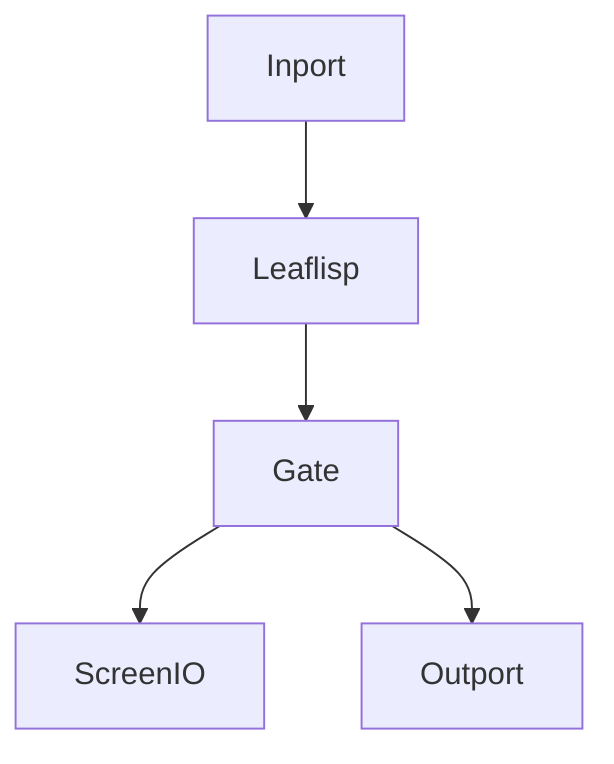

# LEAF Documentation

## Overview
This repository contains documentation for **LEAF**, a graph-based dataflow programming language with a complementary text domain powered by **LEAFlisp**.

This documentation is organized into a structured layout for LEAF.

## When to use
Use this repository when you need:
- A conceptual model of LEAF nodes, edges, and execution.
- Getting-started guides for first workflows.
- A navigable reference baseline to iteratively refine.

## Example
Start here:
1. [What Is LEAF](docs/introduction/what-is-leaf.md)
2. [Quickstart](docs/getting-started/quickstart.md)
3. [Architecture Overview](docs/architecture/overview.md)

## Related topics
See also:
- [Summary / Navigation](SUMMARY.md)
- [Core Concepts: Nodes](docs/core-concepts/nodes.md)
- [Workflows: Execution Lifecycle](docs/workflows/execution-lifecycle.md)

## License
This documentation is licensed under
[Creative Commons Attribution 4.0 International (CC BY 4.0)](LICENSE.md).
