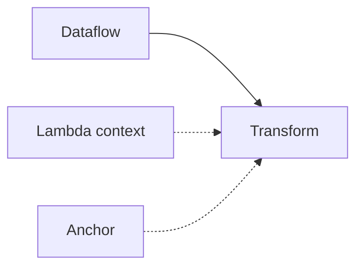

# 001 Graph Model

## Overview
Decision: represent LEAF programs as graph-native dataflow systems with additional lambda and anchor relations.

Status: accepted (draft).

Rationale:
- Makes execution pathways visible and inspectable.
- Reduces cognitive load compared to hidden textual control flow.
- Supports modularity through abstraction nodes and page-level composition.

## When to use
Use this ADR when evaluating model-level changes that affect graph semantics.

## Example

## Related topics
See also:
- [Graph Model](../core-concepts/graph-model.md)
- [Edges](../core-concepts/edges.md)
- [Architecture Overview](../architecture/overview.md)
