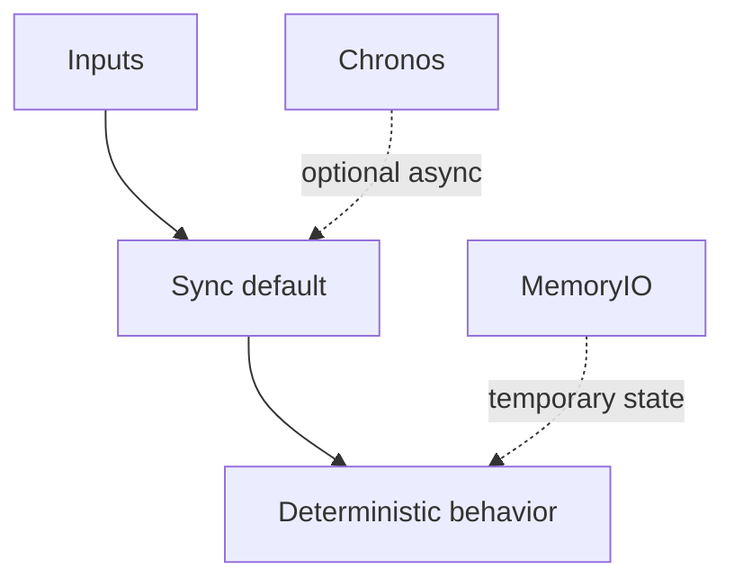

# 002 Runtime Design

## Overview
Decision: adopt data-driven node evaluation with synchronous multi-input behavior by default, while providing explicit opt-in primitives for asynchronous behavior and temporary state.

Status: accepted.

Rationale:
- Predictable default behavior for most workflows.
- Explicit async (`chronos`) reduces accidental race complexity.
- Functional-purity-first runtime with explicit temporary state (`memoryio`).

## When to use
Use this ADR when changing scheduling, state, or execution-trigger semantics.

## Example

## Related topics
See also:
- [Execution Model](../architecture/execution-model.md)
- [Scheduling](../workflows/scheduling.md)
- [State Management](../architecture/state-management.md)
