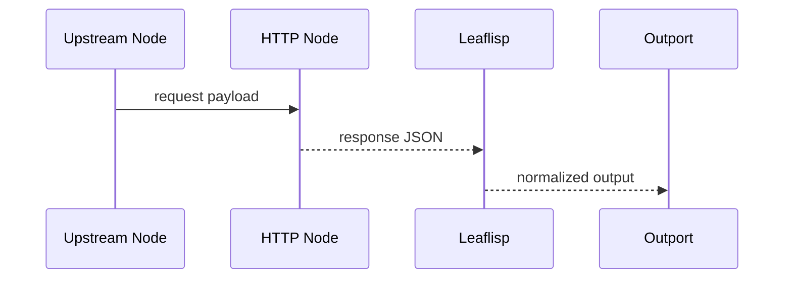

# REST

## Overview
REST is implied by HTTP element capabilities in the source corpus (GET/POST usage). This draft treats REST calls as explicit nodes in the workflow graph.

## When to use
Use this page when integrating external HTTP services in LEAF workflows.

## Example

## Related topics
See also:
- [API Overview](overview.md)
- [Authentication](authentication.md)
- [Backend Example](../examples/backend-example.md)
