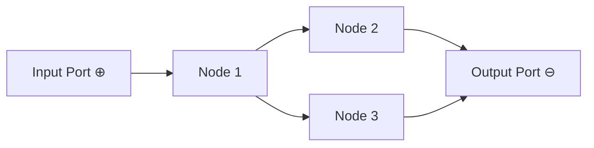

# Data Flow

## Overview
In LEAF, the dataflow plane is horizontal and directional: data moves from left to right across connected nodes. Input ports are on the left of nodes; output ports are on the right.

A node may have zero or more incoming and outgoing dataflow edges.

## When to use
Use this page when debugging value propagation or ordering assumptions in a graph.

## Example

## Related topics
See also:
- [Execution Model](execution-model.md)
- [Edges](../core-concepts/edges.md)
- [Workflows](../core-concepts/workflows.md)
