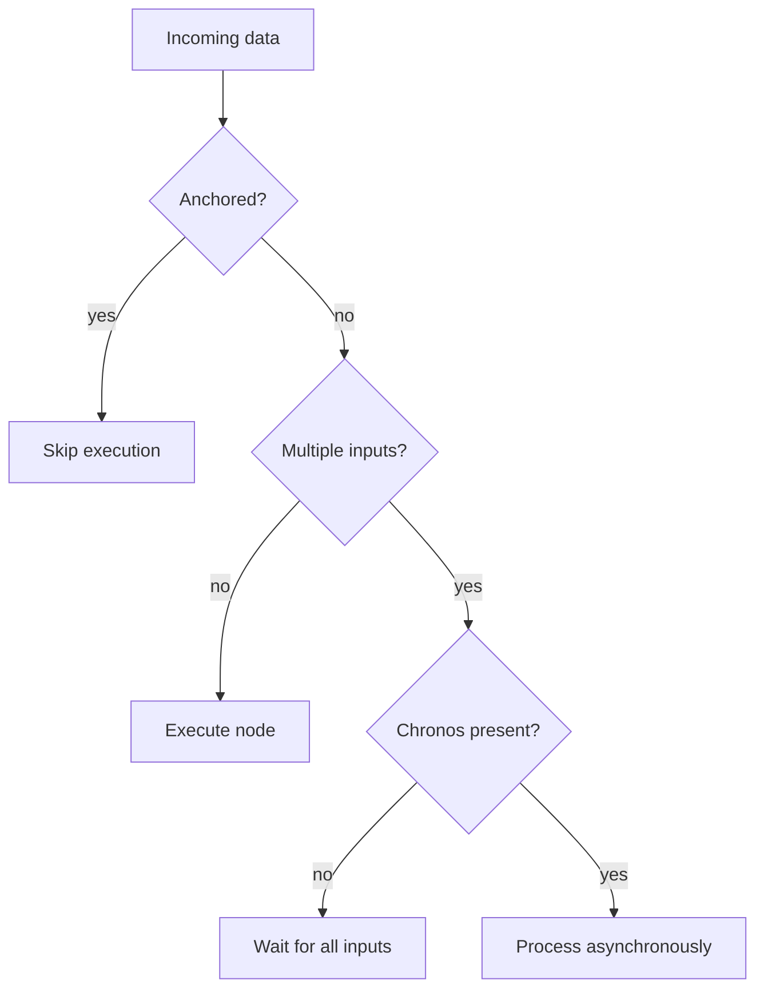

# Execution Model

## Overview
Execution in LEAF is data-driven. Nodes fire when their required inputs are available. The corpus describes default synchronous behavior for multi-input nodes, plus explicit mechanisms to alter that behavior:
- `chronos`: allows asynchronous handling of multiple incoming lines.
- `anchor`: inactivates a graph/subgraph (similar to commenting-out behavior).

## When to use
Use this page when flow execution timing or conditional activation is unclear.

## Example

## Related topics
See also:
- [Event System](event-system.md)
- [State Management](state-management.md)
- [Scheduling](../workflows/scheduling.md)
