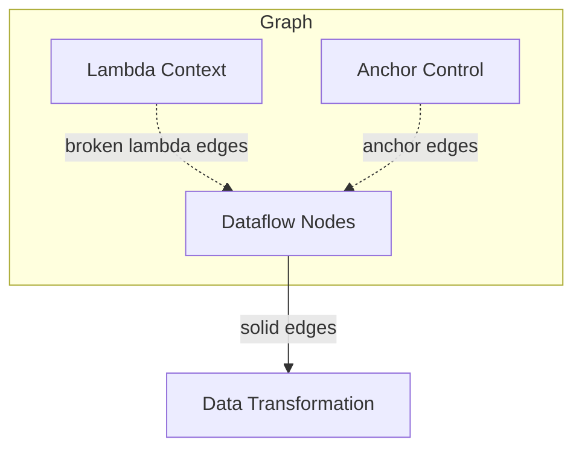

# Overview

## Overview
LEAF architecture can be understood as three interacting planes over a graph of nodes:
- Dataflow plane: left-to-right data movement.
- Lambda plane: top-to-bottom functional/context wiring.
- Anchor plane: execution control through anchoring.

## When to use
Use this page as the top-level architecture map before reading lower-level pages.

## Example
Read [Data Flow](data-flow.md) first, then [Execution Model](execution-model.md), then [State Management](state-management.md).

## Related topics
See also:
- [System Components](system-components.md)
- [Graph Model](../core-concepts/graph-model.md)
- [Runtime](../core-concepts/runtime.md)
