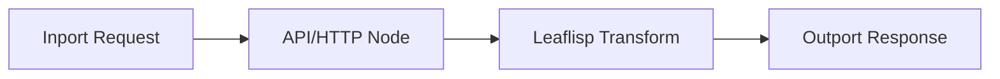

# API Layer

## Overview
The API layer in LEAF is graph-modeled: request and response handling is represented explicitly through nodes and edges.

API calls are treated as integration nodes plus LEAFlisp transformations for payload normalization.

## When to use
Use this page when defining external service contracts or response-shaping patterns.

## Example

## Related topics
See also:
- [API REST](../api/rest.md)
- [API Schemas](../api/schemas.md)
- [Error Handling](../workflows/error-handling.md)
