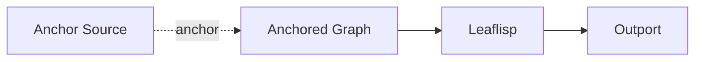

# Anchor Edge

## Overview
Anchor edges are purple broken control lines used to inactivate graphs when attached through anchor ports.

## Usage pattern
- Connect to a node's anchor port to mark its graph inactive.
- Use hanger-port connections to establish control wiring without affecting the source node.
- Apply anchor wiring for safe staged rollout and debugging isolation.

## Example

## Related topics
See also:
- [Edges](../edges.md)
- [Dataflow Edge](dataflow.md)
- [Execution Model](../../architecture/execution-model.md)
- [Anchor Node](../node-types/anchor.md)
