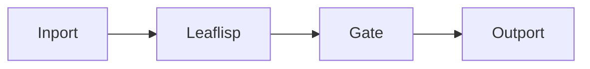

# Dataflow Edge

## Overview
Dataflow edges are solid lines that carry data left to right in LEAF's dataflow plane.

## Usage pattern
- Connect output dataflow ports to input dataflow ports.
- Use clear left-to-right progression for readability.
- Fan out and fan in explicitly with utility nodes such as `mix` and `gate`.

## Example

## Related topics
See also:
- [Edges](../edges.md)
- [Lambda Edge](lambda.md)
- [Anchor Edge](anchor.md)
- [Graph Model](../graph-model.md)
