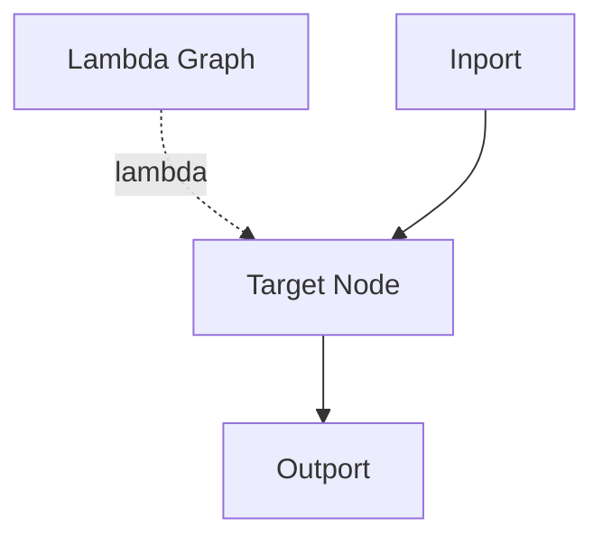

# Lambda Edge

## Overview
Lambda edges are broken lines that connect top to bottom and carry functional context from a lambda graph to a target node.

## Usage pattern
- Connect lambda output ports to lambda input ports.
- Use lambda wiring for shared behavior injection without duplicating graph logic.
- Keep lambda context naming explicit with `label` and `delabel`.

## Example

## Related topics
See also:
- [Edges](../edges.md)
- [Dataflow Edge](dataflow.md)
- [Execution Context](../execution-context.md)
- [Lambda Node](../node-types/lambda.md)
