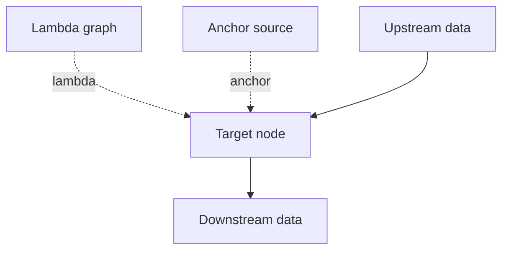

# Edges

## Overview
LEAF defines three edge types:
- Dataflow edges: solid lines carrying data left-to-right.
- Lambda edges: broken lines carrying functional context top-to-bottom.
- Anchor edges: control lines used to inactivate graphs when attached through anchor ports.

## When to use
Use this page when modeling graph connectivity or debugging unexpected execution behavior.

## Example

## Related topics
See also:
- [Data Flow](../architecture/data-flow.md)
- [Execution Model](../architecture/execution-model.md)
- [Graph Model](graph-model.md)
