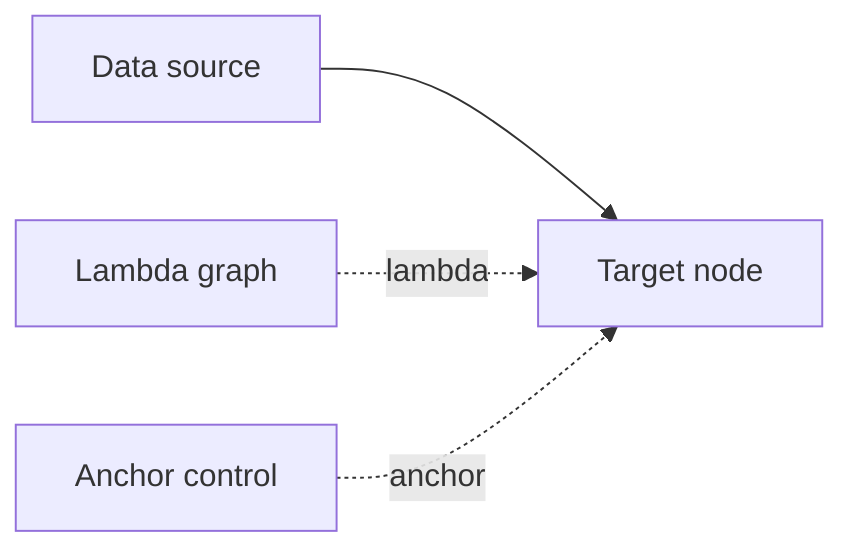
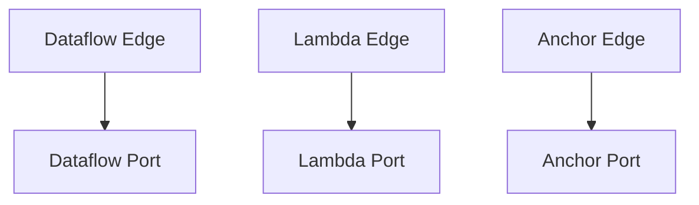

# Edges

## Overview
LEAF defines three edge types:
- Dataflow edges: solid lines carrying data left-to-right.
- Lambda edges: broken lines carrying functional context top-to-bottom.
- Anchor edges: control lines used to inactivate graphs when attached through anchor ports.

## When to use
Use this page as the index for all edge-type documentation.

## Example

## Edge type index
- [Dataflow Edge](edge-types/dataflow.md)
- [Lambda Edge](edge-types/lambda.md)
- [Anchor Edge](edge-types/anchor.md)

## Port compatibility view

## Related topics
See also:
- [Nodes](nodes.md)
- [Data Flow](../architecture/data-flow.md)
- [Execution Model](../architecture/execution-model.md)
- [Graph Model](graph-model.md)
