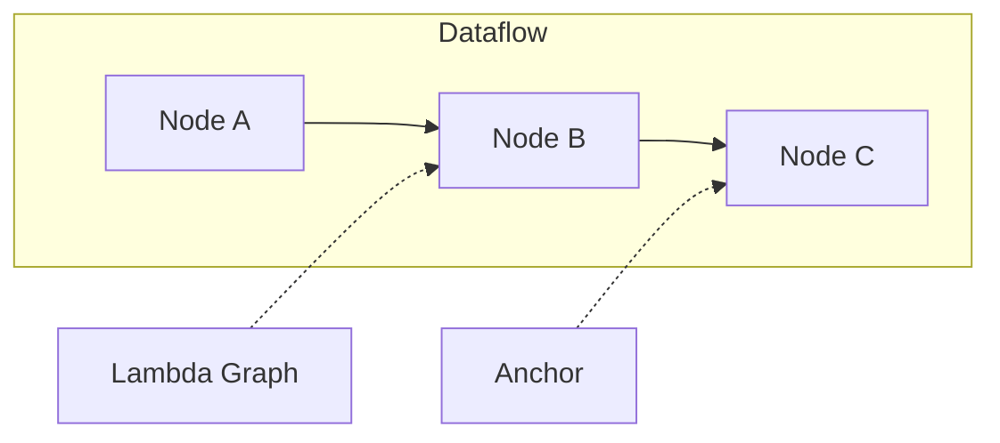

# Graph Model

## Overview
LEAF programs are modeled as directed graphs of nodes and typed edges. LEAF is directed acyclic graph-oriented for dataflow composition, extended by lambda and anchor relations.

## When to use
Use this page when defining graph boundaries, refactoring large workflows, or writing ADRs.

## Example
Encapsulate repeatable logic in [Spelldef Node](node-types/spelldef.md), invoke through [Spell Node](node-types/spell.md), and expose reusable fragments via [Leafgraph Node](node-types/leafgraph.md).

## Related topics
See also:
- [ADR 001: Graph Model](../adr/001-graph-model.md)
- [Nodes](nodes.md)
- [Edges](edges.md)
