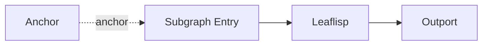

# Anchor Node

## Overview
`anchor` is an abstraction node used for execution control. In LEAF, anchoring a graph excludes that graph from execution.

## Usage pattern
- Use anchor-plane connections to mark branches inactive.
- Keep optional or experimental logic attached but anchored.
- Remove anchoring to re-enable the branch without rewiring dataflow paths.

## Example

## Related topics
See also:
- [Nodes](../nodes.md)
- [Anchor Edge](../edge-types/anchor.md)
- [Execution Model](../../architecture/execution-model.md)
- [Troubleshooting Common Errors](../../troubleshooting/common-errors.md)
