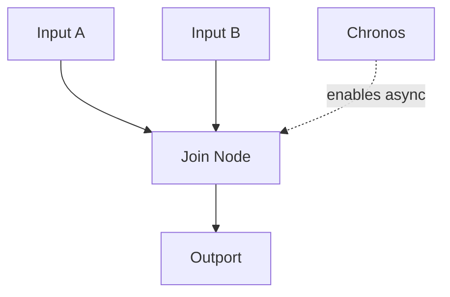

# Chronos Node

## Overview
`chronos` enables asynchronous handling of multiple incoming data lines. Without `chronos`, multi-input fan-in is synchronous by default.

## Usage pattern
- Add `chronos` when waiting for all inputs is too restrictive.
- Keep join logic explicit so timing behavior remains debuggable.
- Validate ordering assumptions with monitoring outputs.

## Example

## Related topics
See also:
- [Nodes](../nodes.md)
- [Scheduling](../../workflows/scheduling.md)
- [Runtime](../runtime.md)
- [Mix Node](mix.md)
