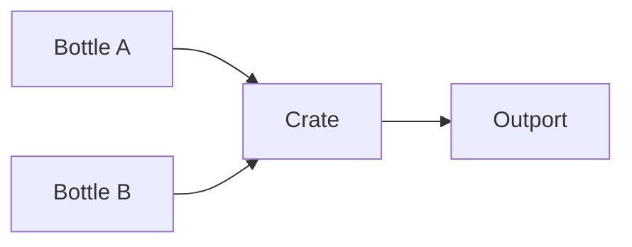

# Crate Node

## Overview
`crate` bundles multiple bottles together with meta labels to organize complex payload sets.

## Usage pattern
- Package several bottled streams into one transport unit.
- Attach metadata that helps downstream routing or selection.
- Unpack later with targeted `unbottle` logic.

## Example

## Related topics
See also:
- [Nodes](../nodes.md)
- [Bottle Node](bottle.md)
- [Unbottle Node](unbottle.md)
- [Label Node](label.md)
