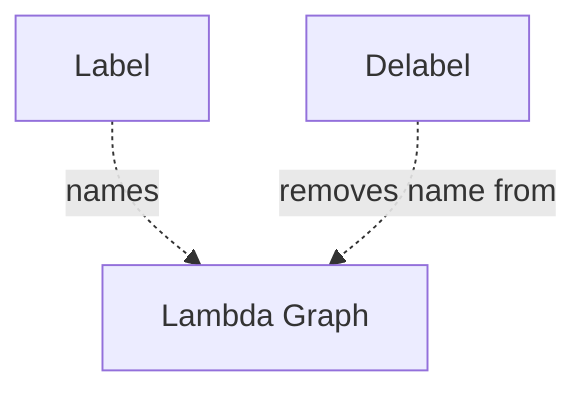

# Delabel Node

## Overview
`delabel` removes a label previously used to name a lambda graph or contextual reference.

## Usage pattern
- Apply `label` when introducing named lambda context.
- Use `delabel` when that named context should no longer apply.
- Keep label lifecycle explicit in complex abstraction flows.

## Example

## Related topics
See also:
- [Nodes](../nodes.md)
- [Label Node](label.md)
- [Execution Context](../execution-context.md)
- [Lambda Edge](../edge-types/lambda.md)
