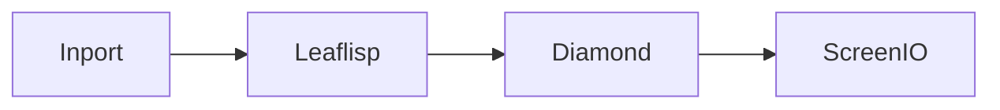

# Diamond Suit Node

## Overview
`diamond` is a canonical suit node type. The source corpus lists it as a first-class node type under element nodes.

## Usage pattern
- Use `diamond` when you want a distinct element node identity in your graph.
- Feed it data through dataflow edges and route output to `screenio` or another element stage.
- Pair with `leaflisp` when payload shaping is required.

## Example

## Related topics
See also:
- [Nodes](../nodes.md)
- [Element Module Node](element.md)
- [ScreenIO Node](screenio.md)
- [Dataflow Edge](../edge-types/dataflow.md)
