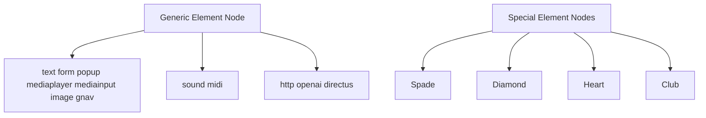
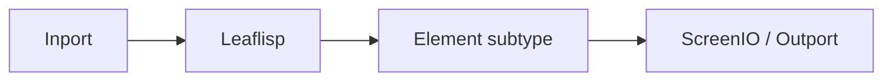

# Element Node

## Overview
`element` is the generic element node type used for building visualization, interaction, media, and integration payloads consumed by `screenio` or downstream processing.

LEAF also includes four special element nodes: [Spade Node](spade.md), [Diamond Node](diamond.md), [Heart Node](heart.md), and [Club Node](club.md).

## Usage pattern
- Select an element subtype by intent (UI, media, or integration).
- Keep data shaping in `leaflisp` and let element nodes handle interaction/render/integration behavior.
- Route interactive visualization payloads to `screenio`.

## Example

## Generic element subtypes
- `text`: creates a text editor with Vim support and outputs interactive visualization data.
- `sound`: defines sound using periodic waveforms; can process MIDI/sound inputs and emit sound output.
- `prompt` (deprecated): prompt/form element; replaced by JSON-form patterns using the `html` element.
- `popup`: wraps visualization content in a popup window.
- `openai`: provides API-level access to OpenAI generative models (text and image usage noted in corpus).
- `midi`: provides MIDI interface input data from connected instruments.
- `mediaplayer`: creates interactive audio/video playback visualization (for example, YouTube-sourced content).
- `mediainput`: creates interactive visualization for image data input.
- `image` (deprecated): interactive image visualization; replaced by `html`-based methods.
- `http`: performs HTTP requests, including `GET` and `POST`.
- `gnav`: creates immersive interactive 3D navigation visualizations.
- `form`: creates forms for prompting users for input.
- `directus`: spawns and interacts with a Directus backend CMS.

## Special element nodes
`spade`, `diamond`, `heart`, and `club` are special element nodes with their own dedicated node types and docs:
- [Spade Node](spade.md)
- [Diamond Node](diamond.md)
- [Heart Node](heart.md)
- [Club Node](club.md)

## Related topics
See also:
- [Nodes](../nodes.md)
- [Visual Elements](../../frontend/visual-elements.md)
- [Spade Node](spade.md)
- [Diamond Node](diamond.md)
- [Heart Node](heart.md)
- [Club Node](club.md)
- [ScreenIO Node](screenio.md)
- [Dataflow Edge](../edge-types/dataflow.md)
