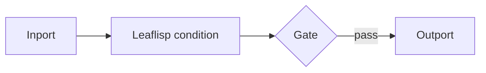

# Gate Node

## Overview
`gate` conditionally passes or stops input data in a workflow branch.

## Usage pattern
- Evaluate a condition upstream (often in `leaflisp`).
- Route payload through `gate` to enforce branch policy.
- Use early in a branch to short-circuit expensive downstream work.

## Example

## Related topics
See also:
- [Nodes](../nodes.md)
- [Mix Node](mix.md)
- [Defining Workflows](../../workflows/defining-workflows.md)
- [Dataflow Edge](../edge-types/dataflow.md)
