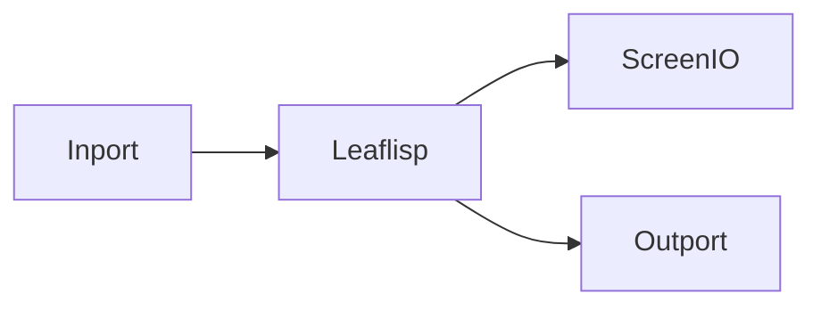

# Inport Node

## Overview
`inport` is the input data entry point for a LEAF workflow.

## Usage pattern
- Start workflows with one or more `inport` nodes.
- Normalize inbound data early using `leaflisp`.
- Branch from the normalized stream into control, utility, and output paths.

## Example

## Related topics
See also:
- [Nodes](../nodes.md)
- [Outport Node](outport.md)
- [Leaflisp Node](leaflisp.md)
- [Quickstart](../../getting-started/quickstart.md)
