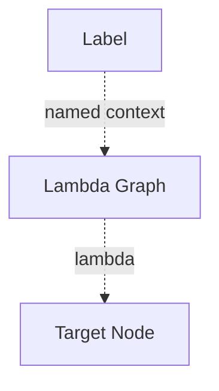

# Label Node

## Overview
`label` names lambda graphs and related context so they can be referenced consistently.

## Usage pattern
- Assign stable names to lambda graph behavior.
- Reuse labeled context across multiple target nodes.
- Remove labels later with `delabel` when scope should end.

## Example

## Related topics
See also:
- [Nodes](../nodes.md)
- [Delabel Node](delabel.md)
- [Execution Context](../execution-context.md)
- [Lambda Edge](../edge-types/lambda.md)
