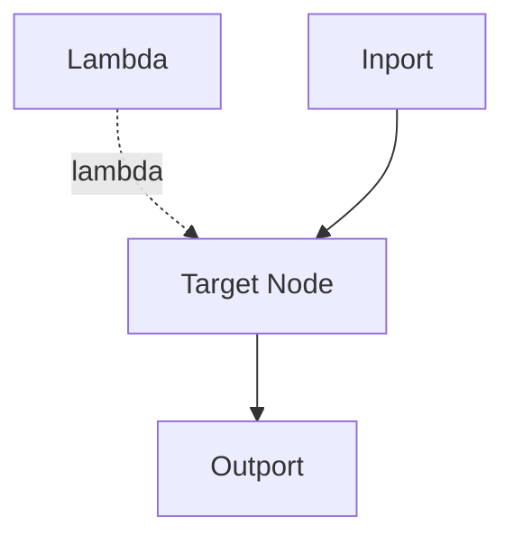

# Lambda Node

## Overview
`lambda` is an abstraction node type used in LEAF's lambda plane to provide functional context to other nodes.

## Usage pattern
- Define behavior context as a lambda graph.
- Connect lambda output to target nodes through lambda edges.
- Use this to avoid duplicating shared transformation policy.

## Example

## Related topics
See also:
- [Nodes](../nodes.md)
- [Lambda Edge](../edge-types/lambda.md)
- [Execution Context](../execution-context.md)
- [Graph Model](../graph-model.md)
