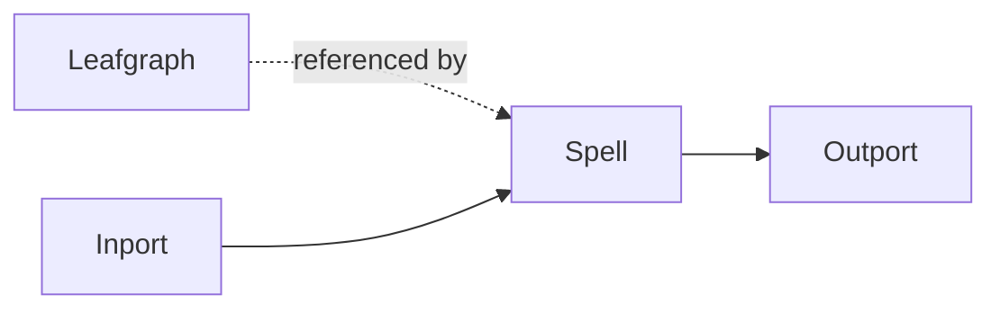

# Leafgraph Node

## Overview
`leafgraph` is an abstraction node used to expose and reference graph fragments as reusable units.

## Usage pattern
- Use `leafgraph` to separate large flows into manageable graph modules.
- Reference graph-level logic across pages or workflow boundaries.
- Pair with `spell`/`spelldef` for structured reuse.

## Example

## Related topics
See also:
- [Nodes](../nodes.md)
- [Spell Node](spell.md)
- [Spelldef Node](spelldef.md)
- [Project Structure](../../getting-started/project-structure.md)
