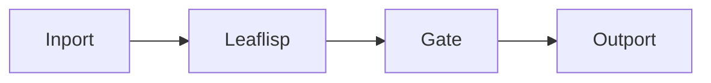

# Leaflisp Node

## Overview
`leaflisp` is the wizardry node that provides textual logic in LEAF using the LEAFlisp dialect with native JSON support.

## Usage pattern
- Use `leaflisp` for data shaping, filtering, and computed values.
- Keep orchestration in graph nodes; keep transformation expressions in LEAFlisp text.
- Emit normalized payloads for downstream utility, element, or I/O nodes.

## Example


```lisp
(do
  (def msg "hello")
  {:message msg :ok true}
)
```

## Related topics
See also:
- [Nodes](../nodes.md)
- [LEAFlisp Reference](../../reference/leaflisp.md)
- [Outport Node](outport.md)
- [Dataflow Edge](../edge-types/dataflow.md)
