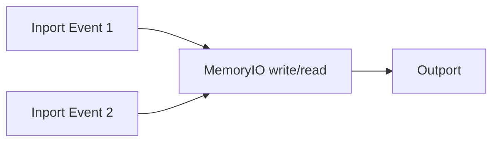

# MemoryIO Node

## Overview
`memoryio` provides temporary local runtime storage for named values. Stored data lasts only for the active runtime execution and is lost on refresh.

## Usage pattern
- Use `memoryio` for short-lived event correlation.
- Avoid treating it as durable persistence.
- Keep reads/writes explicit so stateful behavior is auditable.

## Example

## Related topics
See also:
- [Nodes](../nodes.md)
- [State Management](../../architecture/state-management.md)
- [Persistence](../../backend/persistence.md)
- [Outport Node](outport.md)
