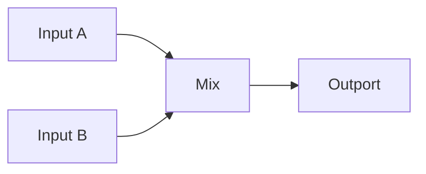

# Mix Node

## Overview
`mix` combines data from multiple input lines in different ways depending on graph design needs.

## Usage pattern
- Use `mix` at fan-in points where multiple streams must be merged.
- Normalize mixed output in `leaflisp` when shape consistency matters.
- Place after gating/filtering to avoid unnecessary aggregation.

## Example

## Related topics
See also:
- [Nodes](../nodes.md)
- [Gate Node](gate.md)
- [Chronos Node](chronos.md)
- [Dataflow Edge](../edge-types/dataflow.md)
