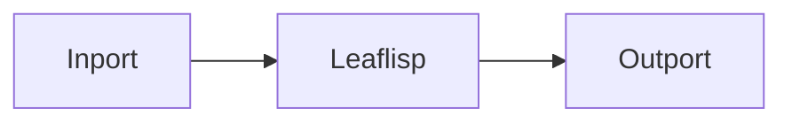

# Outport Node

## Overview
`outport` is the output data exit point of a LEAF workflow.

## Usage pattern
- Terminate workflow branches with `outport` when data must leave the graph.
- Keep final payload shape explicit before the outport boundary.
- Use additional debug outports for observability during development.

## Example

## Related topics
See also:
- [Nodes](../nodes.md)
- [Inport Node](inport.md)
- [ScreenIO Node](screenio.md)
- [Workflows Overview](../../workflows/overview.md)
