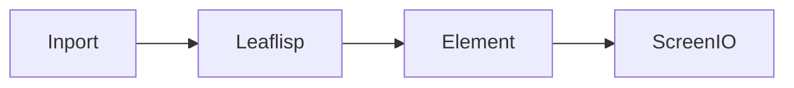

# ScreenIO Node

## Overview
`screenio` displays visualization data on screen as the final rendering endpoint.

## Usage pattern
- Route UI payloads from element or `leaflisp` paths into `screenio`.
- Keep view-model shaping upstream so `screenio` stays a pure render boundary.
- Pair with `outport` if you need both visual and machine-consumable outputs.

## Example

## Related topics
See also:
- [Nodes](../nodes.md)
- [Element Node](element.md)
- [Outport Node](outport.md)
- [Frontend Overview](../../frontend/overview.md)
