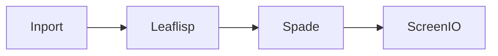

# Spade Node

## Overview
`spade` is an element node used to define how arbitrary data is visualized and interacted with in LEAF.

## Usage pattern
- Accept structured input from dataflow or LEAFlisp transforms.
- Build an element payload that represents UI behavior.
- Send the resulting payload to `screenio` for rendering.

## Example

## Related topics
See also:
- [Nodes](../nodes.md)
- [Element Node](element.md)
- [ScreenIO Node](screenio.md)
- [Dataflow Edge](../edge-types/dataflow.md)
