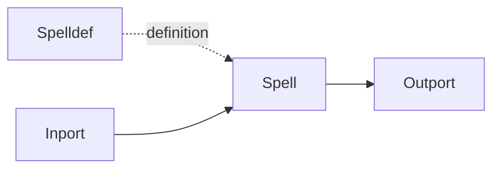

# Spell Node

## Overview
`spell` is an abstraction node used to cast reusable logic defined elsewhere in the graph model.

## Usage pattern
- Define reusable behavior once, then invoke it from one or more `spell` nodes.
- Use `spell` to keep workflows modular as complexity grows.
- Route outputs back to dataflow for downstream processing.

## Example

## Related topics
See also:
- [Nodes](../nodes.md)
- [Spelldef Node](spelldef.md)
- [Leafgraph Node](leafgraph.md)
- [Graph Model](../graph-model.md)
