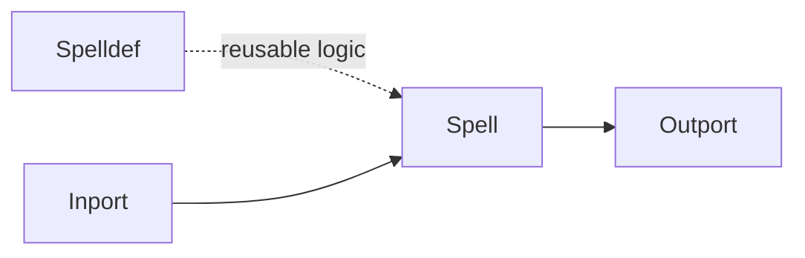

# Spelldef Node

## Overview
`spelldef` is an abstraction node for declaring reusable spell behavior that can later be cast through `spell`.

## Usage pattern
- Encapsulate repeatable logic in `spelldef`.
- Keep each definition focused on one responsibility.
- Reuse the same definition from multiple `spell` call sites.

## Example

## Related topics
See also:
- [Nodes](../nodes.md)
- [Spell Node](spell.md)
- [Loopyspell Node](loopyspell.md)
- [Graph Model](../graph-model.md)
