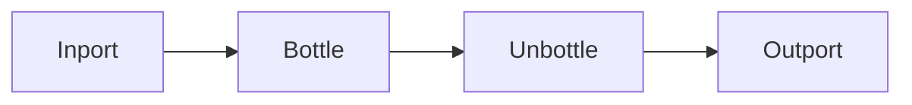

# Unbottle Node

## Overview
`unbottle` extracts content from bottled data by breaking the bottle. Once unbottled, the original bottle wrapper is removed.

## Usage pattern
- Use `bottle` to compartmentalize payloads in transit.
- Use `unbottle` at the point where raw content is needed.
- Keep unbottling close to consumers to preserve structure upstream.

## Example

## Related topics
See also:
- [Nodes](../nodes.md)
- [Bottle Node](bottle.md)
- [Crate Node](crate.md)
- [Dataflow Edge](../edge-types/dataflow.md)
