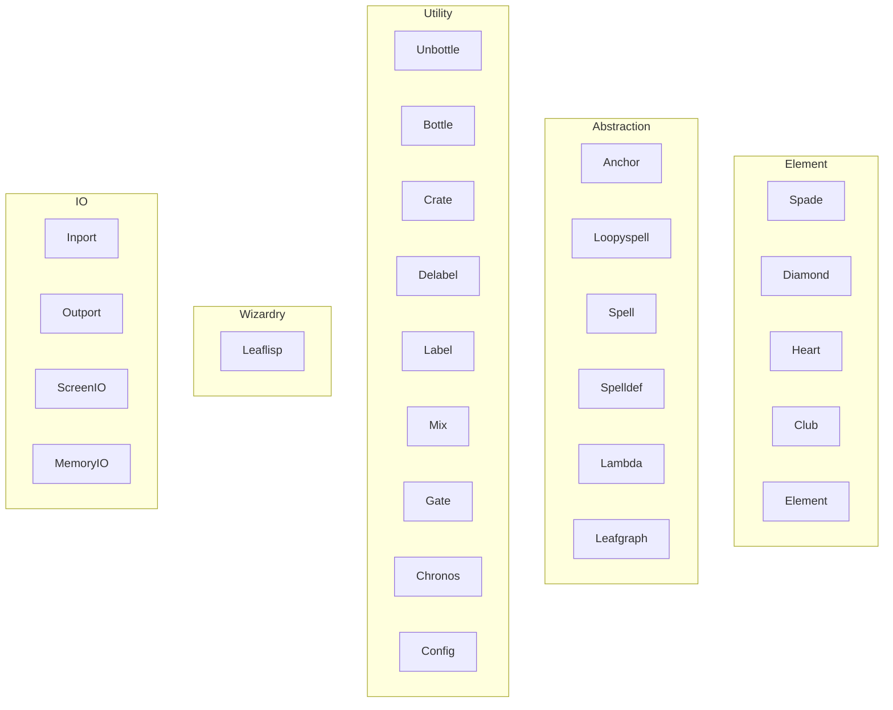

# Nodes

## Overview
Nodes are the primary executable units in LEAF. LEAF defines 25 node types across five categories:
- Element nodes: suit nodes (`spade`, `diamond`, `heart`, `club`) and the element module node (`element`).
- Abstraction nodes: `anchor`, `loopyspell`, `spell`, `spelldef`, `lambda`, `leafgraph`.
- Utility nodes: `unbottle`, `bottle`, `crate`, `delabel`, `label`, `mix`, `gate`, `chronos`, `config`.
- Wizardry nodes: `leaflisp`.
- I/O nodes: `outport`, `inport`, `screenio`, `memoryio`.

Each node has a handle and a subset of ports based on compatible edge types.

## When to use
Use this page as the index for all node-type documentation.

## Example

## Node type index

### Element nodes
- [Spade Suit Node](node-types/spade.md)
- [Diamond Suit Node](node-types/diamond.md)
- [Heart Suit Node](node-types/heart.md)
- [Club Suit Node](node-types/club.md)
- [Element Module Node](node-types/element.md)

### Abstraction nodes
- [Anchor Node](node-types/anchor.md)
- [Loopyspell Node](node-types/loopyspell.md)
- [Spell Node](node-types/spell.md)
- [Spelldef Node](node-types/spelldef.md)
- [Lambda Node](node-types/lambda.md)
- [Leafgraph Node](node-types/leafgraph.md)

### Utility nodes
- [Unbottle Node](node-types/unbottle.md)
- [Bottle Node](node-types/bottle.md)
- [Crate Node](node-types/crate.md)
- [Delabel Node](node-types/delabel.md)
- [Label Node](node-types/label.md)
- [Mix Node](node-types/mix.md)
- [Gate Node](node-types/gate.md)
- [Chronos Node](node-types/chronos.md)
- [Config Node](node-types/config.md)

### Wizardry nodes
- [Leaflisp Node](node-types/leaflisp.md)

### I/O nodes
- [Inport Node](node-types/inport.md)
- [Outport Node](node-types/outport.md)
- [ScreenIO Node](node-types/screenio.md)
- [MemoryIO Node](node-types/memoryio.md)

## Related topics
See also:
- [Edges](edges.md)
- [Dataflow Edge](edge-types/dataflow.md)
- [Lambda Edge](edge-types/lambda.md)
- [Anchor Edge](edge-types/anchor.md)
- [Execution Context](execution-context.md)
- [LEAFlisp Reference](../reference/leaflisp.md)
- [Visual Elements](../frontend/visual-elements.md)
