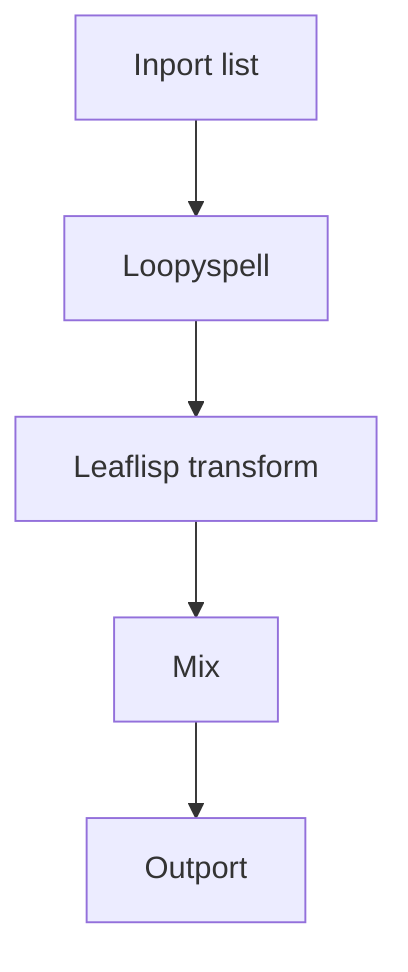

# Advanced Workflow

## Overview
This example highlights abstraction and control patterns with `spelldef`, `spell`, and `loopyspell`, plus optional asynchronous behavior via `chronos`.

## When to use
Use this example when scaling beyond linear flows into iterative or context-sensitive orchestration.

## Example

Loopyspell usage modes:
1. In-situ spell definition and casting.
2. Iteration.
3. Awaiting semantics.

## Related topics
See also:
- [Scheduling](../workflows/scheduling.md)
- [Execution Context](../core-concepts/execution-context.md)
- [Runtime](../core-concepts/runtime.md)
- [Loopyspell Node](../core-concepts/node-types/loopyspell.md)
- [Spell Node](../core-concepts/node-types/spell.md)
- [Spelldef Node](../core-concepts/node-types/spelldef.md)
