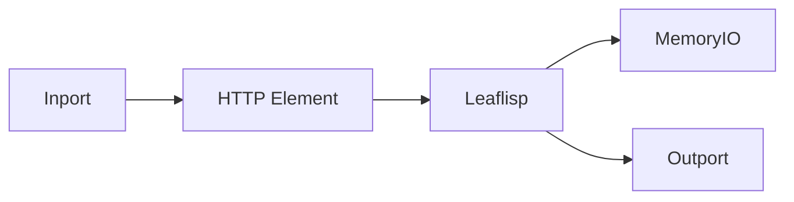

# Backend Example

## Overview
This draft backend example combines API request handling and temporary state coordination in a LEAF graph.

## When to use
Use this example when wiring LEAF workflows to external services.

## Example

Pattern notes:
- Use HTTP-like element nodes for network requests.
- Validate and transform response payloads in LEAFlisp.
- Use `memoryio` only for runtime-local transient state.

## Related topics
See also:
- [Backend API Layer](../backend/api-layer.md)
- [API REST](../api/rest.md)
- [Persistence](../backend/persistence.md)
