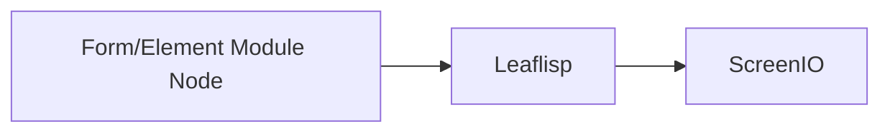

# Frontend Example

## Overview
LEAF element nodes can generate interactive visualization payloads consumed by `screenio`.

## When to use
Use this example when building graph-driven UI behavior.

## Example

Pattern notes:
- Use element nodes to capture user interaction.
- Use LEAFlisp for shaping view model payloads.
- Route final payload to `screenio`.

## Related topics
See also:
- [Frontend Overview](../frontend/overview.md)
- [Visual Elements](../frontend/visual-elements.md)
- [Event System](../architecture/event-system.md)
