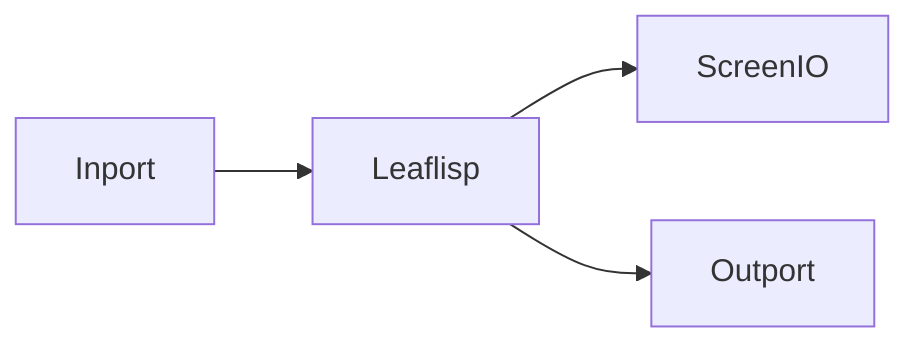

# Simple Workflow

## Overview
This example demonstrates a small end-to-end LEAF graph: input text, conditional transform, and output rendering.

## When to use
Use this example for onboarding and smoke testing.

## Example


```lisp
(if (== inport "happiness")
  "is here"
  "is there"
)
```

## Related topics
See also:
- [Quickstart](../getting-started/quickstart.md)
- [First Workflow](../getting-started/first-workflow.md)
- [Error Handling](../workflows/error-handling.md)
