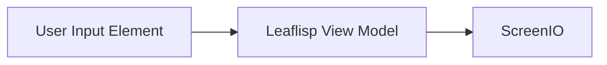

# Overview

## Overview
Frontend behavior in LEAF is graph-driven: element nodes emit interactive visualization data, and `screenio` renders the final view payload.

The corpus references element families for text editing, media, form-like interaction, and visualization.

## When to use
Use this page when designing user-facing flows inside LEAF graphs.

## Example

## Related topics
See also:
- [Visual Elements](visual-elements.md)
- [Dynamic Rendering](dynamic-rendering.md)
- [Frontend Example](../examples/frontend-example.md)
