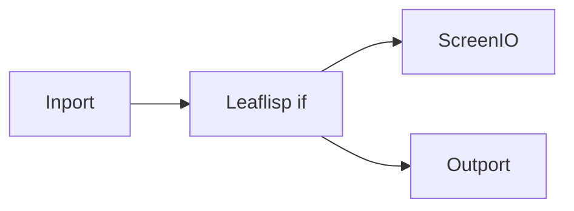

# First Workflow

## Overview
A first workflow should emphasize the core LEAF mechanics: dataflow direction, node processing, and output handling.

## When to use
Use this page when teaching LEAF basics or validating that your editor/runtime setup is working.

## Example
Build this flow and run with input `"happiness"`:



```lisp
(if (== inport "happiness")
  "is here"
  "is there"
)
```

## Related topics
See also:
- [Quickstart](quickstart.md)
- [Execution Model](../architecture/execution-model.md)
- [Error Handling](../workflows/error-handling.md)
