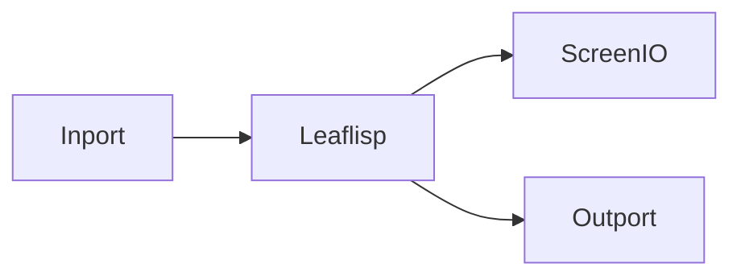

# Quickstart

## Overview
This quickstart builds a small workflow that reads input, transforms it via LEAFlisp, and sends output to both visual and data endpoints.

## When to use
Use this page for your first runnable LEAF graph.

## Example
Graph layout:



Suggested LEAFlisp expression:

```lisp
(do
  (def msg "hello from LEAF")
  {:message msg :status "ok"}
)
```

## Related topics
See also:
- [First Workflow](first-workflow.md)
- [Nodes](../core-concepts/nodes.md)
- [Workflows Overview](../workflows/overview.md)
