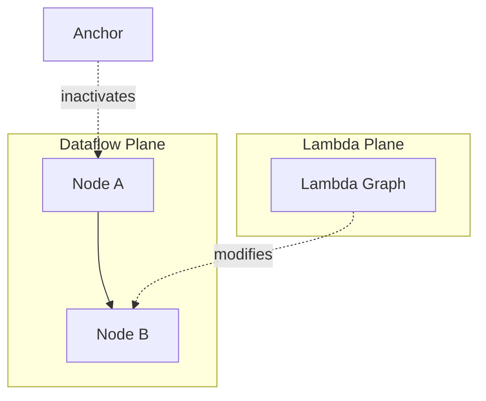

# Key Features

## Overview
Key features captured in the source corpus:
- 25 node types grouped into five categories: element, abstraction, utility, wizardry, and I/O.
- Three edge types: dataflow, lambda, and anchor.
- Multi-plane graph model: horizontal dataflow and vertical lambda context.
- LEAFlisp support for JSON-native transformations and functional composition.
- Execution control primitives such as `anchor` and asynchronous coordination via `chronos`.

## When to use
Use this page as a fast checklist of what LEAF can do before deeper architecture review.

## Example

## Related topics
See also:
- [Nodes](../core-concepts/nodes.md)
- [Edges](../core-concepts/edges.md)
- [Node Type Pages](../core-concepts/nodes.md#node-type-index)
- [Edge Type Pages](../core-concepts/edges.md#edge-type-index)
- [Execution Context](../core-concepts/execution-context.md)
