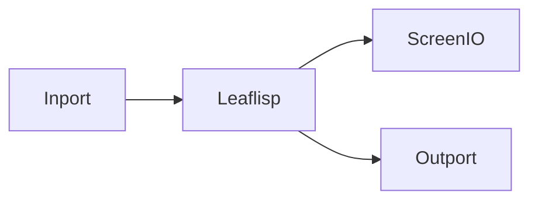

# What Is LEAF

## Overview
LEAF is a graph-based dataflow programming language designed to reduce the cognitive burden of programming. A LEAF program is made of nodes and edges: nodes process input data and emit output data, while edges define how data and behavior move through the graph.

LEAF has two complementary domains:
- Graph domain: visual coordination of dataflow, abstraction, and execution control.
- Text domain: LEAFlisp expressions for data structure and transformation logic.

## When to use
Use LEAF when you need to build interactive or data-driven systems through visual composition rather than traditional control-flow-heavy code.

## Example
A minimal LEAF flow can read input, transform it with LEAFlisp, then display and emit it.

See [Quickstart](../getting-started/quickstart.md) for a step-by-step version.

## Related topics
See also:
- [Design Goals](design-goals.md)
- [Key Features](key-features.md)
- [Graph Model](../core-concepts/graph-model.md)
