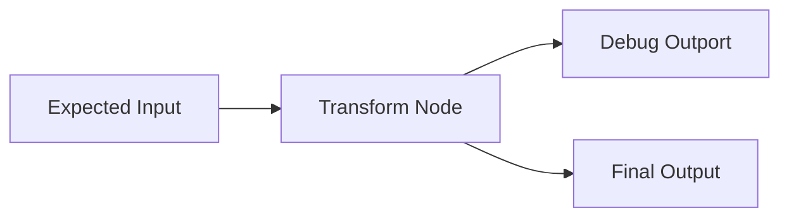

# Debugging

## Overview
Debugging in LEAF is graph-first: inspect node wiring, verify input arrival, and trace intermediate values through outputs or node-specific tools.

## When to use
Use this page when workflow behavior diverges from expectation.

## Example

## Related topics
See also:
- [Monitoring](../workflows/monitoring.md)
- [Common Errors](common-errors.md)
- [Testing Integration](../testing/integration-testing.md)
