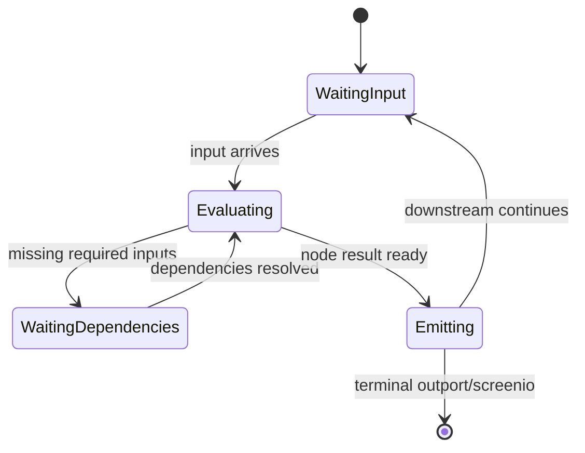

# Execution Lifecycle

## Overview
Execution lifecycle in LEAF is event-driven: data enters the graph, nodes evaluate when ready, outputs are emitted, and optional runtime-local state is updated.

## When to use
Use this page to debug where execution stalls, branches unexpectedly, or completes incorrectly.

## Example

## Related topics
See also:
- [Execution Model](../architecture/execution-model.md)
- [Monitoring](monitoring.md)
- [Troubleshooting Debugging](../troubleshooting/debugging.md)
