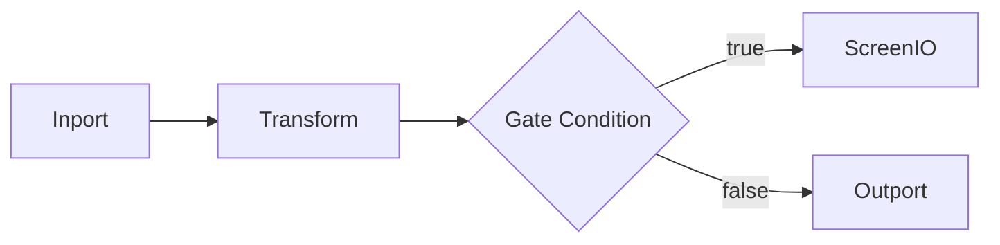

# Overview

## Overview
LEAF workflows define end-to-end behavior by wiring nodes across dataflow, lambda, and anchor planes. Workflows can be composed with spells and specialized with loopyspell patterns.

## When to use
Use this page when scoping a workflow before implementation.

## Example

## Related topics
See also:
- [Defining Workflows](defining-workflows.md)
- [Core Concepts: Workflows](../core-concepts/workflows.md)
- [Execution Lifecycle](execution-lifecycle.md)
