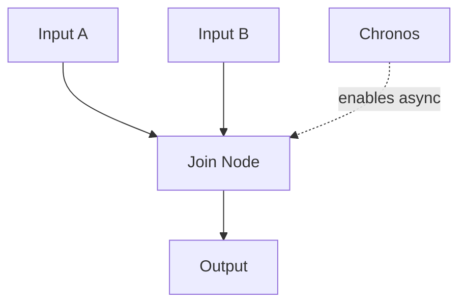

# Scheduling

## Overview
Scheduling in LEAF emerges from graph topology and input readiness. Default behavior for multiple incoming lines is synchronous fan-in. The `chronos` node is used when asynchronous handling is required.

## When to use
Use this page when sequencing and timing across multiple streams matter.

## Example

## Related topics
See also:
- [Execution Model](../architecture/execution-model.md)
- [Loopyspell Patterns](../examples/advanced-workflow.md)
- [Chronos Node](../core-concepts/node-types/chronos.md)
- [Monitoring](monitoring.md)
